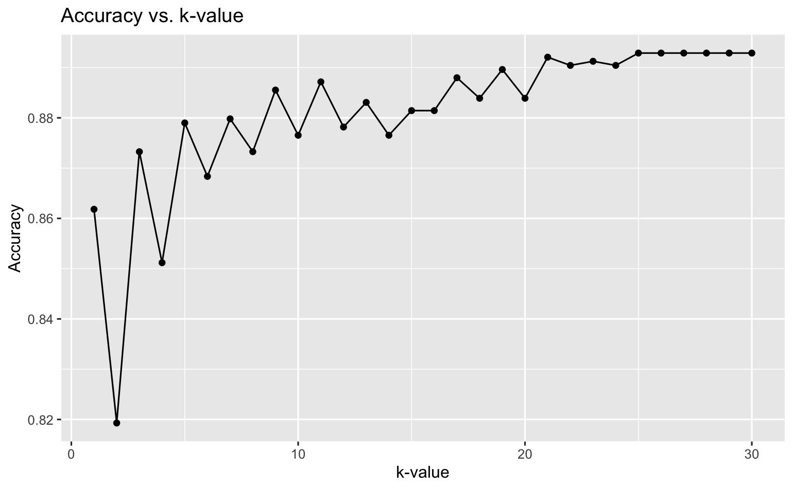
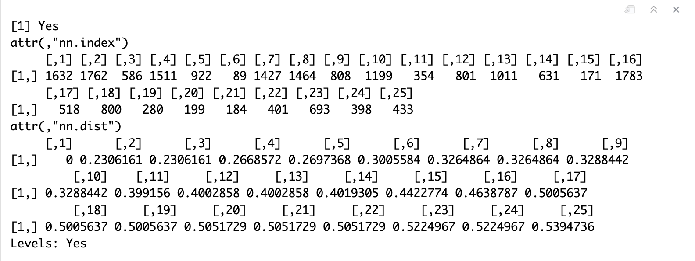
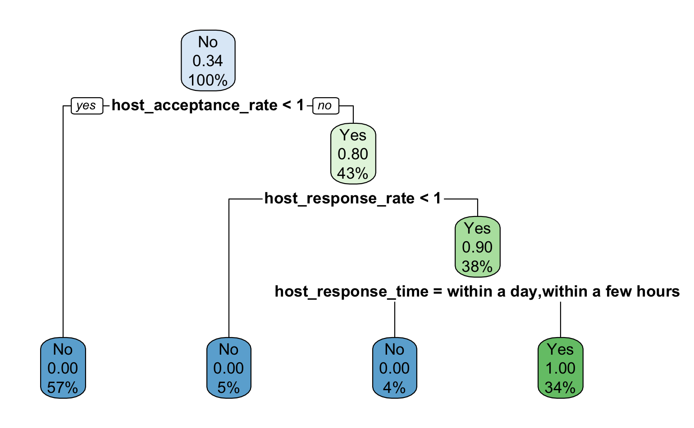
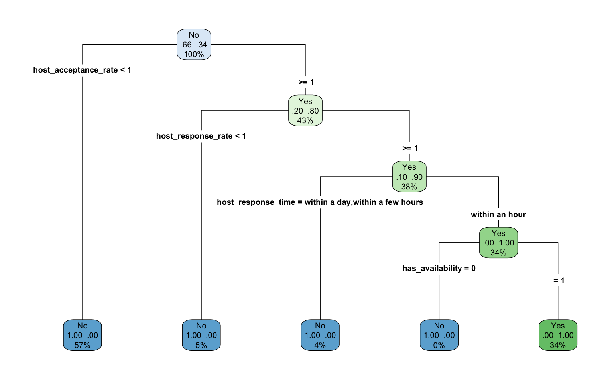

# Rome Listings Data Analysis: K-Nearest Neighbors and Decision Tree

This project focuses on three key parts of the Rome Listings dataset:

* Data Cleaning and Preparation

* K-Nearest Neighbors (KNN) Classification

* Decision Tree Classification

The goal was to preprocess the dataset to remove inconsistencies and apply classification algorithms to predict two main outcomes:

* Whether a property has a kitchen (using KNN)

* Whether a property is instantly bookable (using Decision Tree)

### Data Cleaning

* Removed entire columns with extensive missing values, such as neighbourhood_group_cleansed, bathrooms, and calendar_updated.

* Imputed missing values between bedrooms and beds where possible.

* Dropped rows where both bedrooms and beds were missing.

* Converted Price, host_response_rate, and host_acceptance_rate into numeric formats.

* Selectively handled outliers based on context (e.g., listings with a very high number of reviews were retained).

* Standardized missing entries and omitted rows with widespread NAs.

### K-Nearest Neighbors (KNN) Model
Objective: Predict whether a listing has a kitchen.

Input Variables:

* Initially selected 7 variables: price, host_total_listings_count, accommodates, bedrooms, availability_30, minimum_nights, maximum_nights.

* Removed price and maximum_nights after t-tests due to high variability.

Steps:

* Split data into training and validation sets.

* * Normalized features.

* Tuned K values from 1 to 30.

* Chose optimal K = 25.

* Predicted random property (row 157) as having a kitchen.

### Classification Tree Model

Objective: Predict whether a listing is instantly bookable.

Feature Engineering:

Created instantly_bookable variable based on host and availability features.

Input Variables:

* Selected 18 key variables including host details, property information, and review scores.

Steps:

* 40:60 training-validation split.

* Built an initial tree without cross-validation.

* Built an optimal tree using 5-fold cross-validation (with CP pruning).

* Predicted random property (row 157) as Not Instantly Bookable.

### Requirements

* R

* R Libraries:

  * caret

  * rpart

  * rpart.plot

  * dplyr

  * tidyverse

